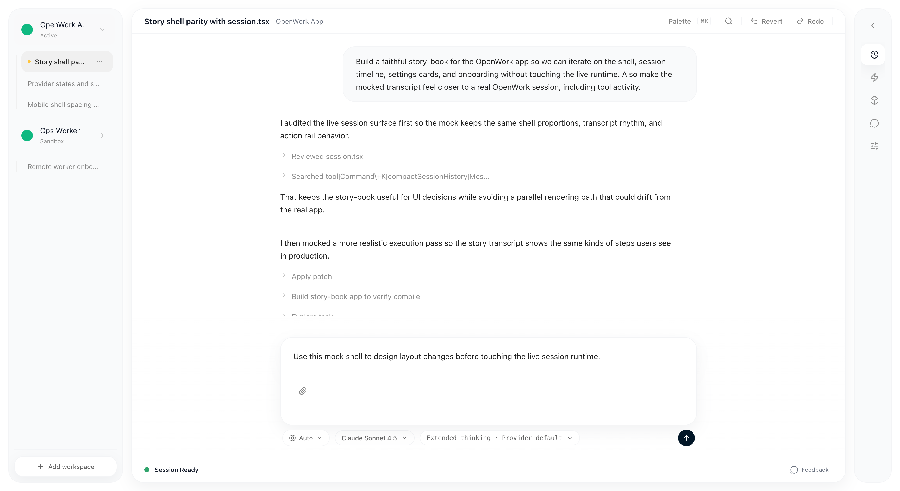

# Model Behavior Picker UX

## What changed

- Replaced generic `thinking` labels with model-aware behavior copy.
- Moved behavior selection into the model picker so users see model + reasoning controls together.
- Added a story-book preview for the composer trigger and settings card.

## Story-book proof

### Composer preview

Verified:
- The active model and its reasoning profile are separated into two dropdowns.
- The Agent, Model, and Thinking dropdowns, along with the Run button, are moved underneath the composer text area with `mt-2`.
- The attachment button remains inside the composer context at the bottom left.

### Settings preview

Verified:
- Settings preview shows the selected default model.
- The model behavior row explains the current reasoning style in plain language.
- `Open picker` routes to the same picker used from the composer.

### Picker preview

Verified:
- The picker explains each model's reasoning pattern (`Reasoning effort`, `Extended thinking`, `Built-in reasoning`).
- The active model exposes inline behavior options on its card.
- Switching from Claude to GPT-5 updated the composer label from `Extended thinking · Maximum` to `Reasoning effort · Provider default`.

## Validation

- `pnpm --filter @openwork/app typecheck`
- `pnpm --filter @openwork/story-book typecheck`
- `pnpm --filter @openwork/app build`
- `pnpm --filter @openwork/story-book build`
- Chrome DevTools MCP against `pnpm --filter @openwork/story-book dev --host 127.0.0.1 --port 4174`

## Notes

- Chrome MCP console showed no runtime errors from this change.
- DevTools reported an existing accessibility issue in story-book about form fields missing `id`/`name`; this feature did not add that issue.
- Attempted `packaging/docker/dev-up.sh`, but the local dev stack did not become healthy in this worktree: the orchestrator install hit a pnpm file-copy ENOENT and the share build was later killed with exit `137`.
