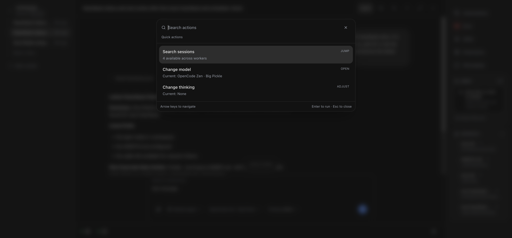
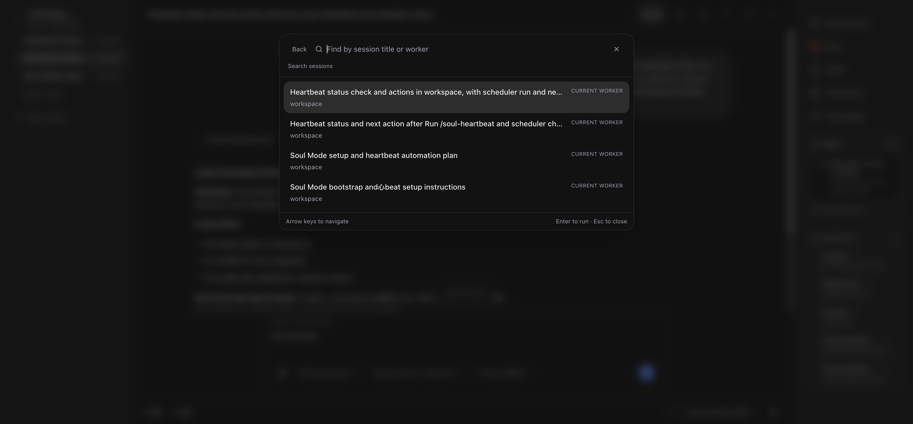
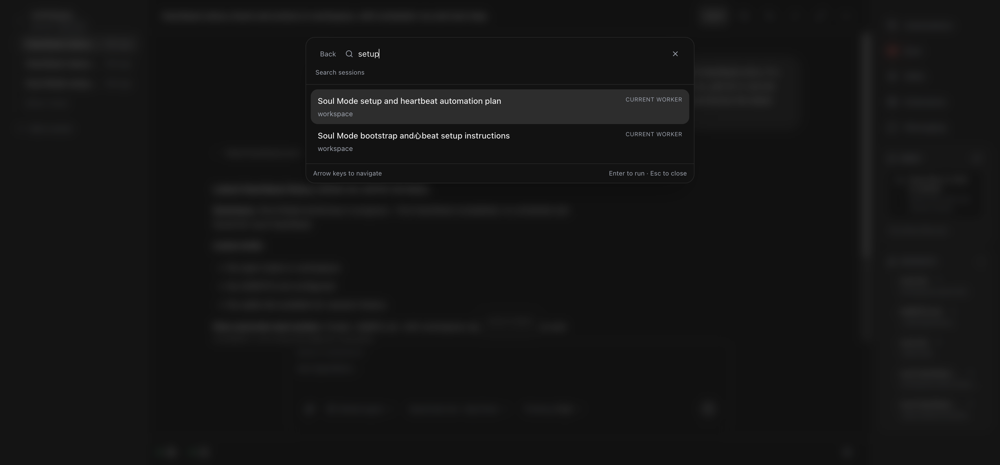
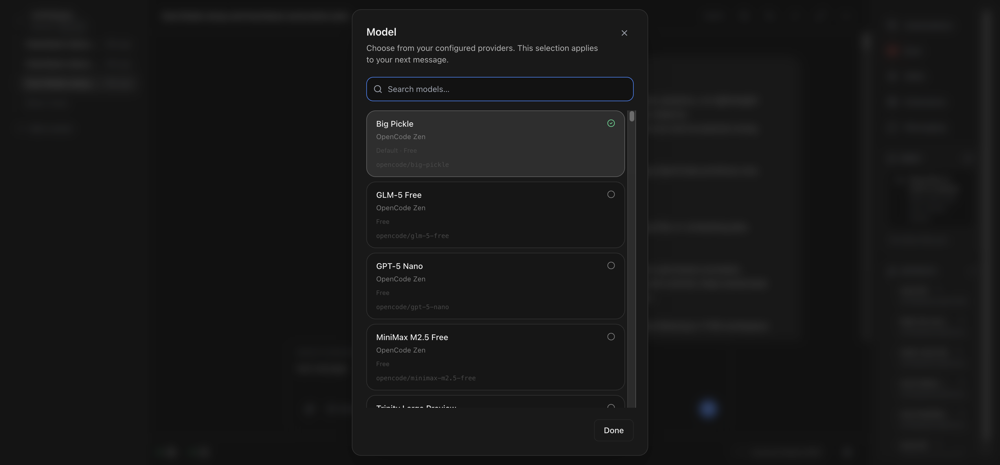
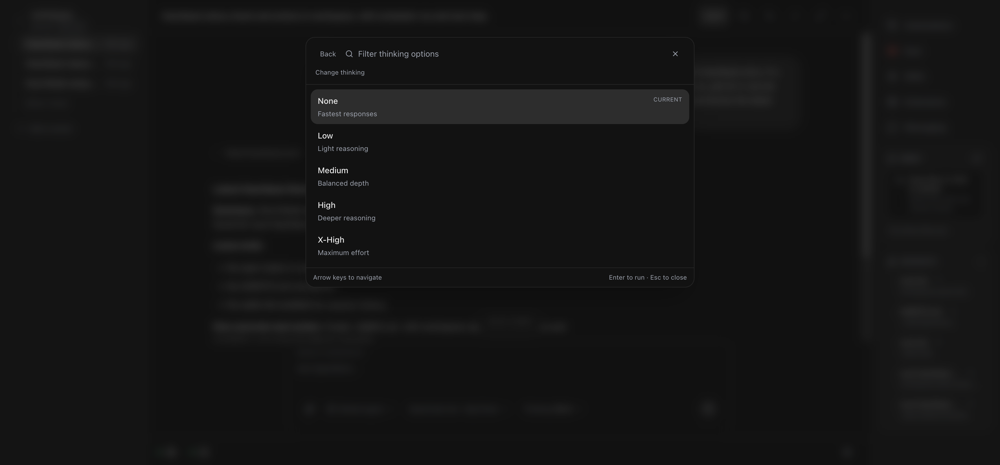
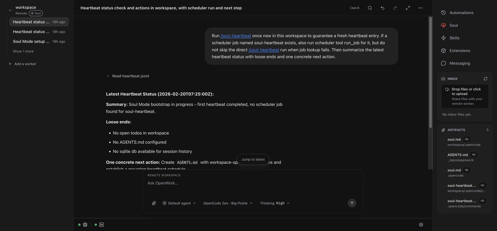

# Cmd+K Proof: Session Search, Model, Thinking

## What was implemented

- Added a `Cmd+K` quick actions entry point in session view.
- Added root quick actions:
  - `Search sessions`
  - `Change model`
  - `Change thinking`
- Added session search mode with filtering and cross-session jump.
- Added thinking mode with options (`None`, `Low`, `Medium`, `High`, `X-High`) that apply directly.

## End-to-end proof (screenshots reviewed)

I captured and reviewed each screenshot below to verify the flow works.

### 1) Root quick actions are available via Cmd+K

Verified:
- Command palette opens over session view.
- Root actions show `Search sessions`, `Change model`, `Change thinking`.

### 2) Search sessions flow works

Session search mode:

Filtered session search:

Verified:
- `Search sessions` opens a dedicated session search mode.
- Typing filters sessions by title.
- Selecting a result closes the palette and switches to the chosen session.

### 3) Change model flow works

Verified:
- `Change model` opens the model picker modal from Cmd+K.

### 4) Change thinking flow works

Thinking options mode:

Applied state (`Thinking High`):

Verified:
- `Change thinking` opens a dedicated thinking mode in Cmd+K.
- Selecting `High` updates composer state to `Thinking High`.

## Notes on environment

- Attempted `packaging/docker/dev-up.sh` in this worktree; orchestrator container was repeatedly killed (`exit 137`) during dependency install.
- For UI validation, used this worktree's Vite app and connected it to an already-running healthy OpenWork Docker server.
- Chrome MCP was used for the interactive verification and screenshot capture above.
