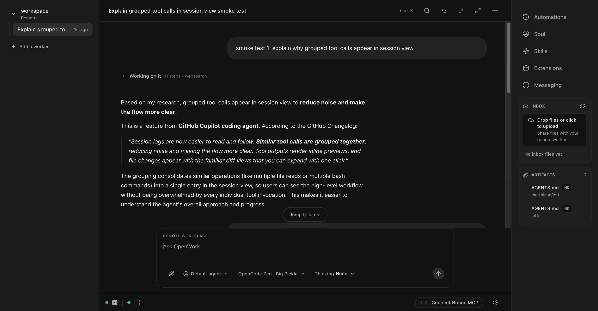
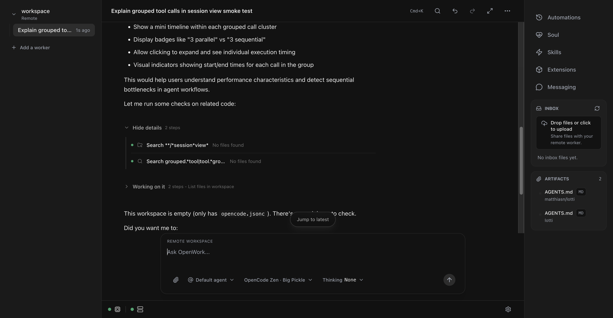
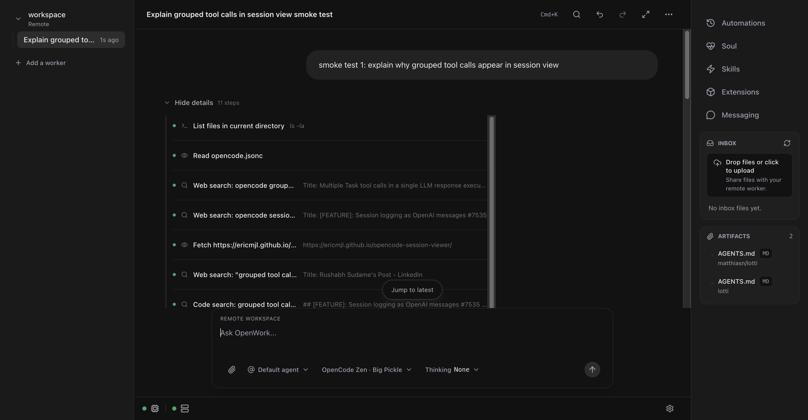

# Session Flow UX: Human Narrative Pass

## What changed

- Removed user-facing meta labels in session message blocks (no `Plan`, `Activity`, or `Answer` tags).
- Kept grouped execution blocks, but changed their collapsed copy to natural language (`Working on it`, `Hide details`).
- Updated grouped execution summaries to avoid raw tool-centric wording.
- Added richer reasoning summaries in `summarizeStep()` so reasoning can render as:
  - `Thinking: <specific headline>`
  - optional paragraph detail under it.
- Removed the extra freeform run-footer detail paragraph to avoid duplicate/noisy narration.

## Why

- Users were seeing internal/meta framing in the timeline instead of a human flow.
- The previous footer detail line looked detached from the timeline and could surface markdown-like noise.
- The new pass keeps the same underlying events while presenting a cleaner narrative sequence.

## End-to-end evidence (Chrome MCP)

### Screenshot 1: Two prompts in one session, with grouped execution rows

Verified:
- Multiple convo turns render in one timeline.
- Grouped execution rows use user-friendly copy (`Working on it`).
- No `Plan/Activity/Answer` tags appear.

### Screenshot 2: Second prompt with grouped steps expanded

Verified:
- Expanded block reveals concrete steps while preserving the simplified outer copy.
- The group can be collapsed/expanded with `Hide details`.

### Screenshot 3: First prompt with grouped steps expanded

Verified:
- Earlier turn remains readable and expandable.
- Step grouping and history remain stable across multiple prompts.

## Conversation prompts used during verification

1. `smoke test 1: explain why grouped tool calls appear in session view`
2. `smoke test 2: think out loud about one possible UX redesign and then run checks`

## Test commands run

- `pnpm typecheck` (pass)
- `pnpm --filter @different-ai/openwork-ui test:health` (fails in this environment: `Unauthorized` on `/global/health`)
- `pnpm --filter @different-ai/openwork-ui test:events` (same `Unauthorized` failure)
- `pnpm --filter @different-ai/openwork-ui test:sessions` (same `Unauthorized` failure)
- `pnpm --filter @different-ai/openwork-ui test:todos` (same `Unauthorized` failure)
- `pnpm --filter @different-ai/openwork-ui test:permissions` (same `Unauthorized` failure)
- `pnpm --filter @different-ai/openwork-ui test:session-switch` (same `Unauthorized` failure)
- `pnpm --filter @different-ai/openwork-ui build` (fails in this environment: missing optional `@rollup/rollup-darwin-arm64`)

## Environment notes

- Docker stack started via `packaging/docker/dev-up.sh` in this worktree.
- Web UI validated at the emitted URL with Chrome MCP.
